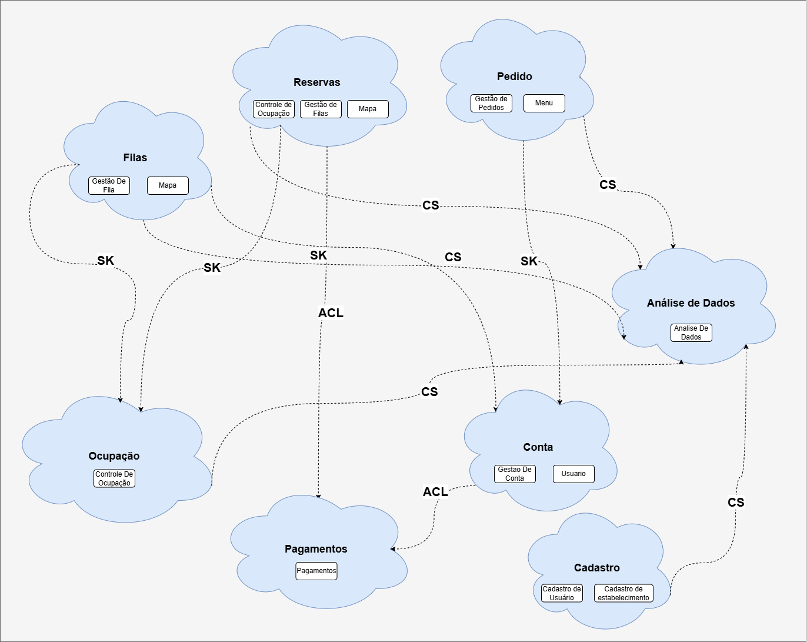

# Dinâmica: Design Estratégico do Projeto

## Objetivo
Identificar os subdomínios do projeto, classificá-los (Core, Supporting, Generic) e desenhar os bounded contexts, incluindo suas interações. Esse exercício ajudará a criar uma visão clara e estratégica do domínio.

---

## 1. Nome do Projeto
**Gestor De Filas**

---

## 2. Objetivo Principal do Projeto
**Melhorar a experiência de visita à restaurantes com alta demanda, através de gestão de filas virtuais.**  


---

## 3. Identificação dos Subdomínios


### Visão cliente
| **Subdomínio**              | **Descrição**                                                                                      | **Tipo**         |
|-----------------------------|--------------------------------------------------------------------------------------------------|------------------|
| Gestão de filas             | Gerenciamento de fila online e fast pass                                                        | Core Domain      |
| Mapa                        | Mapa com restaurantes proximos                                                                  | Generic          |
| Pagamentos                  | Gestao de pagamentos dentro da plataforma                                                       | Generic          |
| Cadastro de usuários        | Cadastro de usuarios na plataforma                                                              | Supporting       |
| Menu        | Menu onde o usuário pode fazer pedidos durante a fila                                                    | Supporting       |
| Gestão dos pedidos          | Gestao da conta das mesas                                                                        | Supporting       |

---
### Visão restaurante
| **Subdomínio**              | **Descrição**                                                                                      | **Tipo**         |
|-----------------------------|--------------------------------------------------------------------------------------------------|------------------|
| Controle de ocupação        | Controle de mesas e filas para gerenciamento da ocupação e dos pedidos                           | Core Domain      |
| Análise dos dados           | Análise de dados para o restaurante (ocupação, picos)                                            | Core domain      |
| Cadastro do Estabelecimento | Cadastro do estabelecimento no sistema                                                           | Supporting       |
| Menu                        | Cadastro do menu do restaurante online                                                           | Supporting       |
| Gestão dos pedidos          | Gestao da conta das mesas                                                                        | Supporting       |

---

## 4. Desenho dos Bounded Contexts


| **Bounded Context**           | **Responsabilidade**                                                                                 | **Subdomínios Relacionados** |
|-------------------------------|-----------------------------------------------------------------------------------------------------|-----------------------------|
| Contexto de reserva  | Gerencia as reservas        | Gestão de filas, Controle de Ocupação, Mapa         |
| Contexto de Filas   | Responsavel por gerenciar a ordem de pessoas na fila.                              | Gestão de Filas, Mapa |
| Contexto de Ocupação   | Responsavel por levantar dados da ocupação e das mesas naquele momento.  | Contole de ocupacao |
| Contexto de Pagamentos   | Processa reservas de restaurantes e repassa para os estabelecimentos.                              | Pagamentos                  |
| Contexto de Analise dos dados   | Responsavel por levantar dados da ocupação, horários e pedidos mais feitos.                              | Analise de dados |
| Contexto de Cadastro  | Responsavel por fazer o cadastro de usuários e estabelecimentos                 | Cadastro de usuarios, cadastro de estabelecimentos |
| Contexto de pedidos   | Responsavel por gerenciar os pedidos feitos nas filas ou nas mesas.                              | Gestão de pedidos, Menu |
| Contexto de Conta   | Responsavel por gerenciar a conta dos usuarios                               | Gestão de pedidos, Usuarios |

---

## 5. Comunicação entre os Bounded Contexts

- **Mensageria/Eventos (desacoplado):** Ex.: O Contexto de Consultas emite um evento "Consulta Finalizada", consumido pelo Contexto de Pagamentos.
- **APIs (síncrono):** Ex.: O Contexto de Pagamentos consulta informações de preços no Contexto de Consultas.

| **De (Origem)**              | **Para (Destino)**          | **Forma de Comunicação**    | **Exemplo de Evento/Chamada**                  |
|------------------------------|-----------------------------|-----------------------------|-----------------------------------------------|
| Contexto de Reserva          | Contexto de Ocupaçao        | API                         | Solicitar reserva.                            |
| Contexto de Filas            | Contexto De Ocupação        | Mensageria (Evento)         | Confirmar que a reserva ou local na fila está ativa      |

---

## 6. Definição da Linguagem Ubíqua
Liste os termos principais da Linguagem Ubíqua do projeto. Explique brevemente cada termo.

| **Termo**                    | **Descrição**                                                                                   |
|------------------------------|-----------------------------------------------------------------------------------------------|
| Pedido              | É o pedido feito peloo cliente ao estabelcimento.                                                       |
| Reserva              | Representa uma reserva entre o cliente e o estabelecimento                                                       |
| Cliente               | Usuário que reserva, paga e faz os pedidos.                                                      |
| Estabelecimento                 | É o estabelecimento (restaurante)                                                 |
| Fila                 | Fila de pessoas esperando uma mesa no restaurante desejado.                                                 |

---

## 7. Estratégia de Desenvolvimento
Para cada tipo de subdomínio, explique a abordagem para implementação:
- **Core Domain:** Controle de mesas e filas para gerenciamento da ocupação e dos pedidos.
- **Supporting Subdomain:** Cadastro de usuarios na plataforma.
- **Generic Subdomain:** Mapa com restaurantes proximos.

| **Subdomínio**              | **Estratégia**                         | **Ferramentas ou Serviços (se aplicável)** |
|-----------------------------|----------------------------------------|-------------------------------------------|
| Controle de Fila            | Desenvolvimento interno                |                                           |
| Controle de Mesas           | Desenvolvimento interno   |                                      |
| Crud de Usuários            | Terceirizar usando API          | Auth0                                    |
| Mapa            | Google Maps          | Google                                    |

---

# 📚 Design Estratégico do Projeto

### **Context Mapping no Projeto**



| **Origem**               | **Destino**              | **Tipo de Relacionamento**       | **Explicação** |
|--------------------------|-------------------------|--------------------------------|---------------|
| Contexto de Fila    | Contexto de Ocupação  | **Shared Kernel**          | Para obter ocupação da unidades para alocar a fila. |
| Contexto de Reserva     | Contexto de Pagamentos   | **Anticorruption Layer (ACL)**            | Para realizar o pagamento pela reserva. |
| Contexto de Pedido  | Contexto de Conta   | **Shared Kernel**                | Para gerar uma conta para o cliente |
| Contexto de Ocupação   | Contexto de Análise de Dados   | **Conformist** | Para enviar dados para análise de dados e dashboard |
| Contexto de Cadastro   | Contexto de Análise de Dados   | **Conformist** | Para enviar dados para análise de dados e dashboard |
| Contexto de Pedido   | Contexto de Análise de Dados   | **Conformist** | Para enviar dados para análise de dados e dashboard |
| Contexto de Reservas   | Contexto de Análise de Dados   | **Conformist** | Para enviar dados para análise de dados e dashboard |
| Contexto de Filas   | Contexto de Análise de Dados   | **Conformist** | Para enviar dados para análise de dados e dashboard |

# 📚 Trabalho - Design Tático no DDD

## **📝 Modelagem do Domínio**

| **Elemento**      | **Entidade ou Value Object?** | **Justificativa** |
|------------------|-----------------------------|-------------------|
| **Cliente**     | Entidade                     | Tem um ID único e pode mudar seus dados ao longo do tempo. |
| **Estabelecimento**       | Entidade                     | Possui identidade única e pode atualizar sua especialidade. |
| **Produto**       | Entidade                     | Possui identidade única e pode atualizar sua especialidade. |
| **Localização**          | Value Object | Sempre pertence a apenas uma Localização e não muda. |
| **Documento**          | Value Object | Sempre pertence a apenas um Cliente ou Estabelecimento e não muda. |
| **Pedido**          | Aggregate Root                 | Vincula os produtos solicitados por um cliente. |
| **Reserva**     | Aggregate Root  | É o vinculo de um cliente à um Estabelecimento para determinado horário. |
| **Fila**          | Aggregate Root | Vincula Clientes à um determinado estabelecimento em ordem. |

---

```csharp
public class Cliente
{
    public Guid Id { get; private set; }
    public string Nome { get; private set; }
    public Documento Documento { get; private set; }
    public DateTime DataNascimento { get; private set; }

    public Cliente(string nome, Documento documento, DateTime dataNascimento)
    {
        if (string.IsNullOrWhiteSpace(nome))
            throw new ArgumentNullException("Necessário preencher o nome.");

        if (dataNascimento == DateTime.MinValue || dataNascimento > DateTime.Now)
            throw new ArgumentNullException("Data de Nascimento inválido.");

        Id = Guid.NewGuid();
        Nome = nome;
        Documento = documento;
        DataNascimento = dataNascimento;
    }


}

public class Localizacao
{
    public string CEP { get; private set; }
    public string Rua { get; private set; }
    public string Bairro { get; private set; }
    public string Cidade { get; private set; }
    public string Estado { get; private set; }
    public string Numero { get; private set; }
    public string Complemento { get; private set; }

    public Localizacao(string cep, string rua, string bairro, string cidade, string estado, string numero, string complemento)
    {
        CEP = string.IsNullOrWhiteSpace(cep) ? throw new ArgumentNullException(nameof(cep)) : cep;
        Rua = string.IsNullOrWhiteSpace(rua) ? throw new ArgumentNullException(nameof(rua)) : rua;
        Bairro = string.IsNullOrWhiteSpace(bairro) ? throw new ArgumentNullException(nameof(bairro)) : bairro;
        Cidade = string.IsNullOrWhiteSpace(cidade) ? throw new ArgumentNullException(nameof(cidade)) : cidade;
        Estado = string.IsNullOrWhiteSpace(estado) ? throw new ArgumentNullException(nameof(estado)) : estado;
        Numero = string.IsNullOrWhiteSpace(numero) ? throw new ArgumentNullException(nameof(numero)) : numero;
        Complemento = string.IsNullOrWhiteSpace(complemento) ? throw new ArgumentNullException(nameof(complemento)) : complemento;
    }
}

public class Estabelecimento
{
    public Guid Id { get; private set; }
    public Localizacao Localizacao { get; private set; }
    public string RazaoSocial { get; private set; }
    public string Descricao { get; private set; }
    public Documento Documento { get; private set; }

    public Estabelecimento(Localizacao localizacao, string razaoSocial, string descricao, Documento documento)
    {
        Id = Guid.NewGuid();
        Localizacao = localizacao ?? throw new ArgumentNullException(nameof(localizacao));
        RazaoSocial = string.IsNullOrWhiteSpace(razaoSocial) ? throw new ArgumentNullException(nameof(razaoSocial)) : razaoSocial;
        Descricao = string.IsNullOrWhiteSpace(descricao) ? throw new ArgumentNullException(nameof(descricao)) : descricao;
        Documento = documento ?? throw new ArgumentNullException(nameof(documento));
    }
}

public class Produto
{
    public Guid Id { get; private set; }
    public string Nome { get; private set; }
    public string Descricao { get; private set; }
    public decimal Preco { get; private set; }
    public bool EhVegano { get; private set; }
    public bool EhSemGluten { get; private set; }
    public bool Disponivel { get; private set; } = true;

    public Produto(string nome, string descricao, decimal preco, bool ehVegano, bool ehSemGluten, bool disponivel)
    {
        if (preco <= 0)
            throw new ArgumentException("Preço deve ser maior que 0.");

        Id = Guid.NewGuid();
        Nome = string.IsNullOrWhiteSpace(nome) ? throw new ArgumentNullException(nameof(nome)) : nome;
        Descricao = string.IsNullOrWhiteSpace(descricao) ? throw new ArgumentNullException(nameof(descricao)) : descricao;
        Preco = preco;
        EhVegano = ehVegano;
        EhSemGluten = ehSemGluten;
        Disponivel = disponivel;
    }
    public void MarcarIndisponivel() => Disponivel = false;
    public void MarcarDisponivel() => Disponivel = true;
}

public class Pedido
{
    public Estabelecimento Estabelecimento { get; private set; }
    public Cliente Cliente { get; private set; }
    public List<Produto> Produtos { get; private set; }
    public decimal ValorTotal { get; private set; }
    public decimal Taxa { get; private set; }
    public DateTime DataPedido { get; private set; } = DateTime.Now;

    public Pedido(Estabelecimento estabelecimento, Cliente cliente, List<Produto> produtos, decimal valorTotal, decimal taxa)
    {
        Produtos = produtos ?? throw new ArgumentNullException(nameof(produtos));

        if (produtos.Count <= 0)
            throw new ArgumentException("Necessário ter ao menos um produto vinculado ao pedido.");
        if (valorTotal <= 0)
            throw new ArgumentException("Necessário informar o valor total.");

        ValorTotal = valorTotal;
        Taxa = taxa;
    }

    public void AdicionarProduto(Produto produto){
        Produtos.Add(produto);
    }

    public void RemoverProdutos(Produto produto) {
        Produtos.Remove(produto);
    }
}

public class Documento
{
    public TipoDocumento Tipo { get; private set; }
    public string Numero { get; private set; }

    public Documento(TipoDocumento tipo, string numero)
    {

        if (string.IsNullOrWhiteSpace(numero))
            throw new ArgumentNullException("Necessário preencher o número.");

        if (tipo == TipoDocumento.CPF && !Regex.IsMatch(numero, "^[0-9]{11}$"))
            throw new ArgumentException("CPF inválido!");

        if (tipo == TipoDocumento.CNPJ && !Regex.IsMatch(numero, "^[0-9]{14}$"))
            throw new ArgumentException("CNPJ inválido!");

        Tipo = tipo;
        Numero = numero;
    }
}
public enum TipoDocumento
{
    CPF,
    CNPJ
}
```
